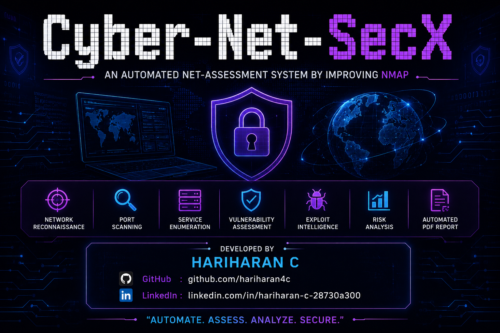

# Cyber-Net-SecX Scanner

<p align="center">
  
</p>

<p align="center">
  
</p>

---

## About

Cyber-Net-SecX Scanner is an Automated Network Penetration Testing and Vulnerability Assessment Tool developed using Python, Nmap, and Metasploit RPC.

The tool helps security professionals automate:

- Network Reconnaissance
- Port Scanning
- Service Enumeration
- Vulnerability Assessment
- Exploit Intelligence
- Risk Analysis
- Automated PDF Report Generation

---

## Features

- Automated Reconnaissance
- Nmap Integration
- Metasploit RPC Integration
- CVSS-based Risk Analysis
- Vulnerability Severity Charts
- Automated PDF Reporting
- Python Modular Architecture
- Kali Linux Support

---

## OS Support

- Kali Linux
- Ubuntu Linux
- Other Debian-based Linux distributions

---

# Installation

## Step 1 — Clone Repository

```bash
git clone https://github.com/hariharan4c/Cyber-Net-SecX-Scanner.git
cd Cyber-Net-SecX-Scanner

---

## Step 2 — Create Virtual Environment

```bash
sudo apt install python3-venv -y
python3 -m venv venv
source venv/bin/activate
```

---

## Step 3 — Install Nmap

```bash
sudo apt install nmap -y
pip install python-nmap
```

---

## Step 4 — Install Required Python Modules

```bash
pip install matplotlib reportlab requests pymetasploit3 pyfiglet
```

---

## Step 5 — Start Metasploit RPC

```bash
msfrpcd -P 123 -S
```

> NOTE:
> Change the RPC password according to your environment configuration.

---

# Tool Execution

Run the scanner:

```bash
cd auto_pentest_scanner
python3 run_full_scan.py
```

---

# Workflow

1. Enter Assessor Name
2. Enter Target IP Address
3. Enter Port Range
4. Reconnaissance Starts
5. Vulnerability Assessment
6. Risk Analysis
7. Severity Chart Generation
8. PDF Report Generation

---

# Technologies Used

- Python
- Nmap
- Metasploit Framework
- ReportLab
- Matplotlib
- Linux

---

# Developed By

Hariharan C

GitHub:
https://github.com/hariharan4c

LinkedIn:
https://www.linkedin.com/in/hariharan-c-28730a300

---

# Disclaimer

This project is developed strictly for educational and authorized security testing purposes only.

Unauthorized scanning or exploitation of systems without permission is illegal.
